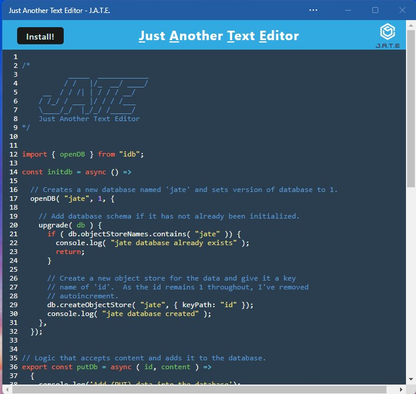

# USYD-FSF Week 19 Project

## Social Network API

### Table of Contents  
  
   1. [Project Description](#1-description)
   2. [Application Features](#2-features)
   3. [Installation](#3-installation)
   4. [Usage](#4-usage)
   5. [Credits](#5-credits)
   6. [License](#6-license)
   7. [Repository Status](#7-github-repo-status)
   8. [Contribute](#8-how-to-contribute)
   9. [Tests](#9-tests)
   10. [Checklist](#10-checklist)

---

### 1. Description  

**What is this project?**  

* This is JavaScript text editor that persists with or without an internet connection.  It uses Progressive Web Application (PWA) technology to do this.  A benefit of PWA is that the application can be installed as a free standing application without having to open your browser.  

* Other technologies used are IndexedDB, Express, Node-js and CodeMirror.  

* The application was deployed on Heroku, however it is now moved to Netlify and refactored as a serverless app  [Netlify: //jate-editor.netlify.app](https://jate-editor.netlify.app).  

**Why this project?**  

* This application demonstrates a number of methods used by the big online companies like Google and Mozilla.  

* PWA's are a great tool to have as a developer as it provides user's with a convenient and therefore more likely to frequently use method for accessing and using your application.

**What problem does this project solve?**  

* Demonstrates a progressive, convenient, efficient and user friendly application that is installable on a user's desktop to improve the likelihood of repeat usage of your application.

**Lessons learnt?**  

* Using IndexedDB client side storage provides similar SQL and noSQL to Create Read Update and Delete - a lot more powerful method than localStorage.  

* With more complexity in the technologies used, problem solving becomes more challenging.  In particular, service workers, require vigilance to make sure you've reset the service worker otherwise your changes do not render.  

* PWA's have a lot happening in the background which can be disconcerting if you prefer driving the programming process more.  

* I fixed the favicon.ico so that it installs properly.  

* Worked out how to get the CodeMirror editor installation to extend the full browser window.  I couldn't work out how to do it in the CSS and discovered how to do it in JavaScript over riding the CSS.

* The application uses indexedDB however I decided that as the application is a text editor and you are copying the entire screen in one go that only the 1 cell is needed in indexedDB.  In other words, the put method over writes the entry in the database every time an update / change is made in the editor.  

---

### 2. Features  

The following animation shows the functioning application:

  

The following shows a screengrab of the functioning application as hosted on Heroku:  

  

---

### 3. Installation

You are welcome to download the source code from [my Github repository](https://github.com/Mark33Mark/PWA_text_editor)  


Once downloaded, you will need to run in the command line:  

```npm install```  

This will install the required dependencies for the application to run.  Now to run the application type in the command line:

``` cd client && npm run build && cd ..```

This will build your `dist` folder.

### <u>Express Server Implementation</u>

```npm start:dev```  

Once the server is up and running, the command line will have a link for you to click to open the application in your chosen browser:

```
🆗  You are now listening on port: http://localhost:3001  🆗
```

Hold down control key and click on the link in your console to open the app.

---  


### <u>Netlify Serverless Implementation</u>

```
ntl dev
```  

Before running this command in your terminal, make sure you have Netlify CLI installed by typing in your terminal:
```
ntl -v  
```
```
netlify -v  
```
If you don't receive a response with a version then install Netlify CLI with:
```
npm install -g netlify-cli
```

---

### 4. Usage  

The code can be downloaded from [my Github repository](https://github.com/Mark33Mark/PWA_text_editor) for all assets created for the project.  
You can modify the code as you need.

---

### 5. Credits  

I've relied heavily on the online documentation for Code Mirror and IndexedDB for this work.  The PWA reference was taken mostly from the University activities.

---

### 6. License  

 The works in this repository are subject to:  

[](./assets/docs/license_MIT.md)

---

### 7. Github repo status  


---

### 8. How to Contribute  

 If you would like to contribute, please comply with the Contributor Covenant Code of Conduct:  

[](./assets/docs/code_of_conduct.md)

---

### 9. Tests  

* No unit tests have been written for this application.  

* There is a problem opening the application on a mobile phone, the header (banner) does not render correctly to the screen.

* There is a slight delay with the application storing the changes made in the editor so if you are too quick to close the application, sometimes the data does not persist.

---

### 10. Checklist  

 All actions not checked are still to be completed:  

[x]  Satisfies the acceptance criteria:  
   * A text editor web application when that you open the application in your coding editor you see a client server folder structure.  
   * Running the application with `npm start` from the root directory, the application starts up the backend and serves the client.  
   * Running the text editor application from the terminal bundles the JavaScript files using webpack.  
   * Running the webpack plugins generates a HTML file, service worker, and a manifest file.
   * Using next-gen JavaScript in my application enables the text editor to function in the browser without errors.  
   * Opening the text editor, the IndexedDB has immediately created a database storage.
   * Entering content and subsequently clicking off of the DOM window I find that the content in the text editor has been saved with IndexedDB.  
   * Reopening the text editor after closing it has the content in the text editor retrieved from the IndexedDB.  
   * Clicking the Install button, downloads the web application as an icon on your desktop.  
   * Loading the web application should have a registered service worker using workbox.  The registering of a service worker has static assets pre cached upon loading along with subsequent pages and static assets.  
   * The application is deployed on Heroku and has proper build scripts for a webpack application.
Uses IndexedDB to create an object store and includes both GET and PUT methods

[x]  The application works without an internet connection.  
[x]  Automatically saves content inside the text editor when the DOM window is unfocused.  
[x]  Bundled with webpack.  
[x]  Create a service worker with workbox that Caches static assets.  
[x]  The application should use babel in order to use async / await.  
[x]  Application must have a generated manifest.json using the WebpackPwaManifest plug-in.  
[x]  Can be installed as a Progressive Web Application.  
[x]  Application deployed to Heroku at live URL with build scripts.  
[x]  Application loads with no errors.  
[x]  Github repository contains application code: [Github location: https://github.com/Mark33Mark/PWA_text_editor](https://github.com/Mark33Mark/PWA_text_editor)  
[x]  GitHub repo contains all application code.  
[x]  Application user experience is intuitive and easy to navigate.  
[x]  Application user interface style is clean and polished.  
[x]  Application resembles the mock-up functionality provided in the homework instructions.  
[x]  Repository has a unique name.  
[x]  Repository follows best practices for file structure and naming conventions.  
[x]  Repository follows best practices for class/id naming conventions, indentation, quality comments, etc.  
[x]  Repository contains multiple descriptive commit messages.  
[x]  Repository contains quality README file with description, screenshot, and link to deployed application.  

---

[Back to the top](#usyd-fsf-week-19-project)  
